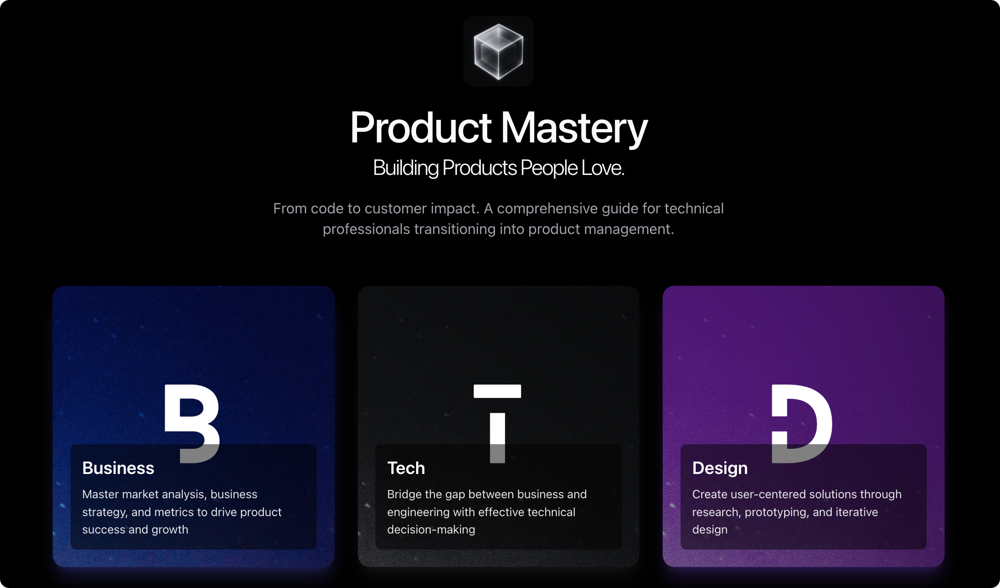

# Product Mastery

## A Comprehensive Guide to Product Management Excellence

Product Mastery is your definitive guide to becoming an exceptional product manager. This comprehensive resource covers everything from fundamental concepts to advanced strategies, designed to help you excel in your product management career.

Whether you're just starting your journey in product management or looking to enhance your existing skills, this guide provides practical insights, frameworks, and best practices that you can apply immediately in your role.

Key features of this guide:
- Comprehensive coverage of essential product management topics
- Practical frameworks and methodologies
- Real-world examples and case studies
- Actionable strategies for career growth
- Expert insights on stakeholder management and communication

--- 

## Table of Contents

- [Introduction to Product Management](#01-introduction-to-product-manager)
- [Essential Marketing Concepts for Product Managers](#02-essential-marketing-concept)
- [Customer Discovery and Research Methods](#03-customer-discovery)
- [Product Vision and Strategy Development](#04-product-vision-and-strategy)
- [Prioritization Frameworks and Decision Making](#05-frameworks-and-decision-making)
- [Product Roadmapping and Planning](#06-product-roadmap)
- [Agile Methodologies and Product Development](#07-agile-methodologies)
- [Cross-Functional Collaboration and Communication](#08-coss-functional-collaboration)
- [Metrics, Analytics, and Data-Driven Decision Making](#09-metrics-analytics-data)
- [Growth Strategies and User Acquisition](#10-growth-strategies)
- [Product Metrics and Success Frameworks](#11-product-metrics)
- [Product Positioning and Launch Strategy](#12-product-launch)
- [Stakeholder Management and Communication Skills](#13-communication-skills)
- [Career Development and Personal Branding](#14-career-development)
- [Product Design and Technical Skills](#15-product-design)
- [Career Advancement and Continuous Learning](#16-continuous-learning)
